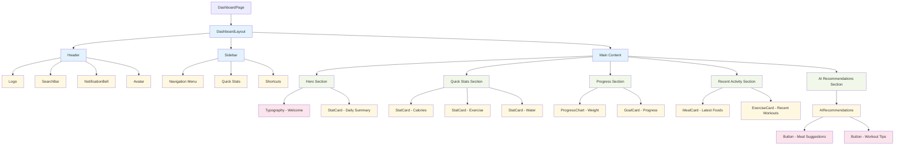
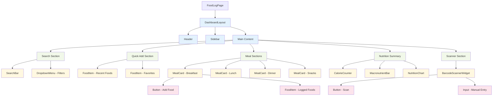
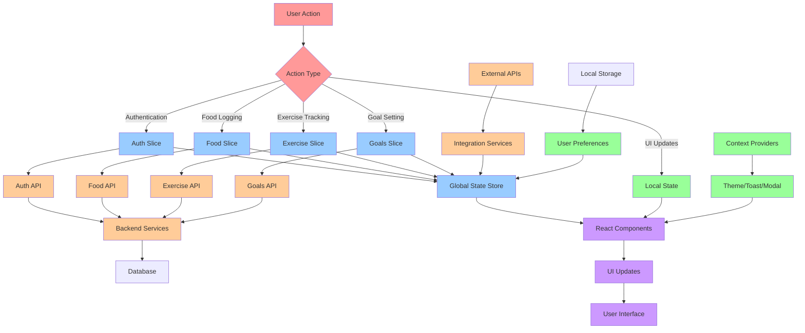

# Health & Nutrition Tracking Website - Frontend Visual Diagrams

## 1. Site Map / Page Flow Diagram

```mermaid
flowchart TD
    A[Landing Page /] --> B[Login /login]
    A --> C[Register /register]
    A --> D[Pricing /pricing]
    A --> E[About /about]
    
    B --> F[Dashboard /dashboard]
    C --> F
    
    B --> G[Forgot Password /forgot-password]
    G --> H[Reset Password /reset-password/:token]
    
    F --> I[Profile /profile]
    F --> J[Food & Nutrition]
    F --> K[Exercise & Activity]
    F --> L[Goals & Progress]
    F --> M[Reports /reports]
    F --> N[Community /community]
    F --> O[Settings]
    
    J --> J1[Food Log /food/log]
    J --> J2[Meal History /food/history]
    J --> J3[Recipe Creator /food/recipes]
    J --> J4[Barcode Scanner /food/scanner]
    J --> J5[Meal Planner /food/planner]
    
    K --> K1[Exercise Log /exercise/log]
    K --> K2[Workout History /exercise/history]
    K --> K3[Workout Templates /exercise/templates]
    K --> K4[Activity Tracker /exercise/activity]
    
    L --> L1[Goal Setting /goals/set]
    L --> L2[Progress Tracking /goals/progress]
    
    N --> N1[Community Feed /community]
    N --> N2[Challenges /community/challenges]
    N --> N3[User Profile /community/profile/:userId]
    
    O --> O1[Account Settings /settings/account]
    O --> O2[Notification Settings /settings/notifications]
    O --> O3[Privacy Settings /settings/privacy]
    O --> O4[Integration Settings /settings/integrations]
    
    F --> P[Premium Features]
    P --> P1[Premium Analytics /premium/analytics]
    P --> P2[Personal Coaching /premium/coaching]
    P --> P3[Custom Meal Plans /premium/meal-plans]
    
    classDef publicPages fill:#e1f5fe
    classDef authPages fill:#f3e5f5
    classDef premiumPages fill:#fff3e0
    classDef mainFeatures fill:#e8f5e8
    
    class A,D,E publicPages
    class B,C,G,H authPages
    class P,P1,P2,P3 premiumPages
    class F,J,K,L,M,N mainFeatures
```



## 2. Component Hierarchy Tree (Dashboard Page)



## 3. Component Hierarchy Tree (Food Log Page)



## 4. Template / Layout Wireframe Diagrams

### DashboardLayout Wireframe
```
┌─────────────────────────────────────────────────────────────────┐
│                         HEADER                                  │
│  [Logo]  [SearchBar]           [Notifications] [Avatar]        │
├─────────────────────────────────────────────────────────────────┤
│        │                                                       │
│        │                 MAIN CONTENT                          │
│        │  ┌─────────────────────────────────────────────────┐  │
│        │  │              Hero Section                       │  │
│        │  │     Welcome Message & Daily Summary            │  │
│        │  └─────────────────────────────────────────────────┘  │
│        │                                                       │
│ SIDEBAR│  ┌─────────────────────────────────────────────────┐  │
│        │  │              Quick Stats                        │  │
│ [Nav]  │  │   [Calories] [Exercise] [Water] [Sleep]        │  │
│        │  └─────────────────────────────────────────────────┘  │
│ [Quick │                                                       │
│ Stats] │  ┌─────────────────────────────────────────────────┐  │
│        │  │              Progress Charts                    │  │
│ [Short │  │      Weight Chart    Goal Progress             │  │
│ cuts]  │  └─────────────────────────────────────────────────┘  │
│        │                                                       │
│        │  ┌─────────────────────────────────────────────────┐  │
│        │  │           Recent Activity                       │  │
│        │  │    Latest Foods    Recent Workouts             │  │
│        │  └─────────────────────────────────────────────────┘  │
│        │                                                       │
│        │  ┌─────────────────────────────────────────────────┐  │
│        │  │         AI Recommendations                      │  │
│        │  │   Meal Suggestions   Workout Tips              │  │
│        │  └─────────────────────────────────────────────────┘  │
└─────────────────────────────────────────────────────────────────┘
```

### AuthLayout Wireframe
```
┌─────────────────────────────────────────────────────────────────┐
│                                                                 │
│                        [Logo]                                  │
│                                                                 │
│                 ┌─────────────────────────┐                    │
│                 │                         │                    │
│                 │      LOGIN FORM         │                    │
│                 │                         │                    │
│                 │  [Email Input]          │                    │
│                 │  [Password Input]       │                    │
│                 │                         │                    │
│                 │  [Login Button]         │                    │
│                 │                         │                    │
│                 │  [Forgot Password?]     │                    │
│                 │  [Sign Up Link]         │                    │
│                 │                         │                    │
│                 │  [Social Login]         │                    │
│                 │  [Google] [Apple]       │                    │
│                 │                         │                    │
│                 └─────────────────────────┘                    │
│                                                                 │
│                                                                 │
│           [Privacy Policy]  [Terms of Service]                 │
└─────────────────────────────────────────────────────────────────┘
```

### CommunityLayout Wireframe
```
┌─────────────────────────────────────────────────────────────────┐
│                         HEADER                                  │
│  [Logo]  [SearchBar]           [Notifications] [Avatar]        │
├─────────────────────────────────────────────────────────────────┤
│        │                                    │                  │
│        │          MAIN FEED                 │   RIGHT PANEL    │
│        │                                    │                  │
│ COMM.  │  ┌─────────────────────────────┐   │ ┌──────────────┐ │
│ SIDEBAR│  │         Post 1              │   │ │  Trending    │ │
│        │  │  [Avatar] [Username]        │   │ │  Topics      │ │
│ [Feed] │  │  [Post Content]             │   │ └──────────────┘ │
│        │  │  [Like] [Comment] [Share]   │   │                  │
│ [Chall │  └─────────────────────────────┘   │ ┌──────────────┐ │
│ enges] │                                    │ │  Suggested   │ │
│        │  ┌─────────────────────────────┐   │ │  Friends     │ │
│ [Groups│  │         Post 2              │   │ │              │ │
│ ]      │  │  [Avatar] [Username]        │   │ │  [User 1]    │ │
│        │  │  [Post Content]             │   │ │  [User 2]    │ │
│ [Leade │  │  [Like] [Comment] [Share]   │   │ │  [User 3]    │ │
│ rboard]│  └─────────────────────────────┘   │ └──────────────┘ │
│        │                                    │                  │
│        │  ┌─────────────────────────────┐   │ ┌──────────────┐ │
│        │  │      [Create Post]          │   │ │  Active      │ │
│        │  └─────────────────────────────┘   │ │  Challenges  │ │
│        │                                    │ └──────────────┘ │
└─────────────────────────────────────────────────────────────────┘
```

## 5. Folder/Directory Structure Tree

```
src/
├── components/
│   ├── atoms/
│   │   ├── Button/
│   │   │   ├── Button.tsx
│   │   │   ├── Button.stories.tsx
│   │   │   ├── Button.test.tsx
│   │   │   └── index.ts
│   │   ├── Input/
│   │   ├── Label/
│   │   ├── Icon/
│   │   ├── Badge/
│   │   ├── Avatar/
│   │   ├── Spinner/
│   │   ├── ProgressBar/
│   │   ├── Toggle/
│   │   ├── Checkbox/
│   │   └── Typography/
│   ├── molecules/
│   │   ├── FormField/
│   │   ├── SearchBar/
│   │   ├── DatePicker/
│   │   ├── Modal/
│   │   ├── StatCard/
│   │   ├── CalorieCounter/
│   │   ├── MacronutrientBar/
│   │   ├── ExerciseCard/
│   │   ├── FoodItem/
│   │   ├── MealCard/
│   │   └── GoalCard/
│   ├── organisms/
│   │   ├── Header/
│   │   ├── Sidebar/
│   │   ├── Footer/
│   │   ├── DashboardSummary/
│   │   ├── FoodLogger/
│   │   ├── ExerciseTracker/
│   │   ├── NutritionChart/
│   │   ├── CalorieChart/
│   │   ├── ProgressChart/
│   │   ├── MealPlanCalendar/
│   │   ├── RecipeBuilder/
│   │   ├── WorkoutBuilder/
│   │   └── AIRecommendations/
│   └── templates/
│       ├── AuthLayout/
│       ├── DashboardLayout/
│       ├── PublicLayout/
│       ├── SettingsLayout/
│       ├── CommunityLayout/
│       └── ReportsLayout/
├── pages/
│   ├── public/
│   │   ├── LandingPage/
│   │   ├── LoginPage/
│   │   ├── RegisterPage/
│   │   └── PricingPage/
│   ├── dashboard/
│   │   └── DashboardPage/
│   ├── food/
│   │   ├── FoodLogPage/
│   │   ├── MealHistoryPage/
│   │   ├── RecipeCreatorPage/
│   │   └── MealPlannerPage/
│   ├── exercise/
│   │   ├── ExerciseLogPage/
│   │   ├── WorkoutHistoryPage/
│   │   └── ActivityTrackerPage/
│   ├── goals/
│   │   ├── GoalSettingPage/
│   │   └── ProgressTrackingPage/
│   ├── reports/
│   │   └── ReportsPage/
│   ├── community/
│   │   ├── CommunityFeedPage/
│   │   └── ChallengesPage/
│   ├── settings/
│   │   ├── AccountSettingsPage/
│   │   └── NotificationSettingsPage/
│   └── premium/
│       ├── PremiumAnalyticsPage/
│       └── CoachingPage/
├── hooks/
│   ├── useAuth.ts
│   ├── useFoodLog.ts
│   ├── useExerciseHistory.ts
│   ├── useForm.ts
│   ├── useModal.ts
│   ├── useToast.ts
│   ├── useCalorieCalculation.ts
│   └── useGoalProgress.ts
├── store/
│   ├── slices/
│   │   ├── authSlice.ts
│   │   ├── userSlice.ts
│   │   ├── foodSlice.ts
│   │   ├── exerciseSlice.ts
│   │   ├── goalsSlice.ts
│   │   ├── notificationSlice.ts
│   │   └── themeSlice.ts
│   ├── api/
│   │   ├── authApi.ts
│   │   ├── foodApi.ts
│   │   ├── exerciseApi.ts
│   │   ├── goalsApi.ts
│   │   └── reportsApi.ts
│   └── store.ts
├── styles/
│   ├── tokens/
│   │   ├── colors.ts
│   │   ├── typography.ts
│   │   ├── spacing.ts
│   │   ├── breakpoints.ts
│   │   └── shadows.ts
│   ├── themes/
│   │   ├── light.ts
│   │   ├── dark.ts
│   │   └── index.ts
│   ├── components/
│   │   ├── GlobalStyles.tsx
│   │   └── ThemeProvider.tsx
│   └── utilities/
│       ├── animations.ts
│       └── mixins.ts
├── services/
│   ├── api.ts
│   ├── auth.ts
│   ├── nutrition.ts
│   └── analytics.ts
├── utils/
│   ├── helpers.ts
│   ├── formatters.ts
│   ├── validators.ts
│   └── constants.ts
├── types/
│   ├── auth.ts
│   ├── food.ts
│   ├── exercise.ts
│   ├── goals.ts
│   └── api.ts
├── assets/
│   ├── images/
│   ├── icons/
│   └── fonts/
├── App.tsx
├── main.tsx
└── index.html
```

## 6. State & Data Flow Diagram



## 7. Diagram Usage Guide

### How to Use These Diagrams

1. **Site Map**: Use for understanding navigation flow and route structure
2. **Component Hierarchy**: Reference when building pages or refactoring components
3. **Wireframes**: Use as layout guides for UI development
4. **Directory Structure**: Follow for consistent file organization
5. **State Flow**: Reference for understanding data management patterns

### Integration with Development Tools

- **Mermaid Diagrams**: Can be rendered in GitHub README, GitLab, and most documentation tools
- **Directory Structure**: Copy-paste into project setup scripts
- **Component Hierarchy**: Use with component development tools like Storybook
- **Wireframes**: Reference for design system creation

### Maintenance Notes

- Update diagrams when adding new features or pages
- Keep component hierarchy in sync with actual implementation
- Review state flow when adding new data requirements
- Validate directory structure against actual project structure

These diagrams provide a comprehensive visual reference for the entire frontend architecture and can be easily integrated into your development workflow and documentation.